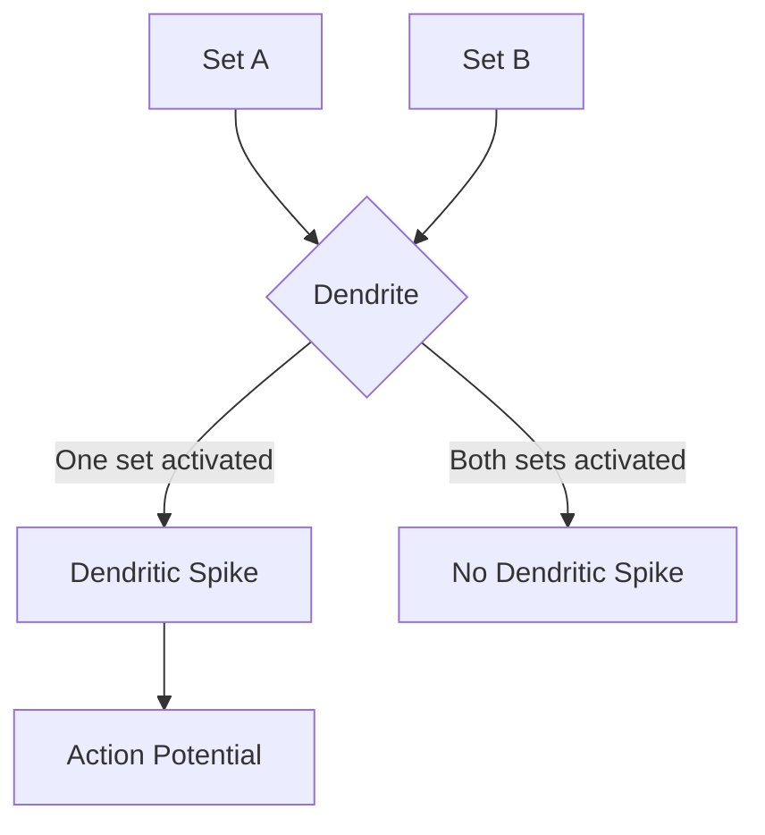

import { Callout, Steps, Step } from "nextra-theme-docs";

# Dendritic Spikes and XOR Operation

In the previous section, we discussed the role of [voltage-gated ion channels](/the-role-of-dendrites-in-neural-computations/voltage-gated-ion-channels) in generating dendritic spikes. Now, let's explore how these dendritic spikes enable individual neurons to perform complex computations, such as the exclusive-or (XOR) operation.

## What is the XOR Operation?

The XOR operation is a logical operation that returns true (1) if exactly one of its inputs is true (1), and false (0) otherwise. The truth table for the XOR operation is as follows:

| Input A | Input B | Output |
|---------|---------|--------|
| 0       | 0       | 0      |
| 0       | 1       | 1      |
| 1       | 0       | 1      |
| 1       | 1       | 0      |

<Callout type="info">
The XOR operation is a linearly non-separable function, which means that it cannot be implemented by a single perceptron or a single layer of neurons. In traditional artificial neural networks, implementing the XOR operation requires a multi-layered network.
</Callout>

## Dendrites and the XOR Operation

Recent research has shown that individual dendrites can perform the XOR operation using dendritic spikes. Here's how it works:

<Steps>

### Step 1: Synaptic Inputs

Suppose a neuron has two sets of synapses, A and B, on its dendrites. When either one of the two sets is activated, the excitation is large enough to elicit a dendritic spike, which can propagate to the soma and trigger an action potential.

### Step 2: Simultaneous Activation

However, if both sets of synapses (A and B) are activated simultaneously, the strength of the incoming current exceeds the optimal value for dendritic spike generation. As a result, no dendritic spike is observed.

</Steps>

This process can be visualized using the following diagram:

In essence, the dendrite performs the XOR operation on inputs A and B:

$XOR(A, B) = \begin{cases}
1, & \text{if } A=1 \oplus B=1 \\
0, & \text{otherwise}
\end{cases}$

<Callout type="success">
This groundbreaking discovery challenges the traditional view of neurons as simple perceptrons and highlights the incredible computational power of dendrites in biological neurons.
</Callout>

By understanding how dendrites perform complex operations like XOR, we can bridge the gap between [artificial neural networks and biological neurons](/artificial-neural-networks-and-biological-neurons) and develop more biologically plausible models of neural computation.