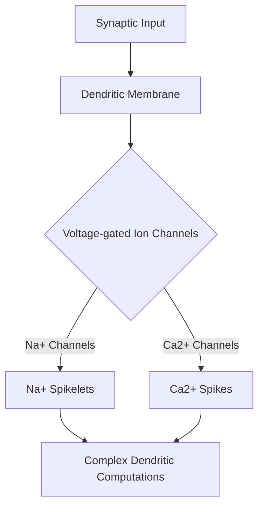

import { Callout, Steps, Step } from "nextra-theme-docs";

# Voltage-gated Ion Channels

Voltage-gated ion channels are a crucial component of neurons that enable them to generate and propagate electrical signals. These channels are embedded in the cell membrane and are sensitive to changes in the membrane potential. When the membrane voltage reaches a specific threshold, these channels open, allowing ions to flow across the membrane, which can lead to the generation of [dendritic spikes](/the-role-of-dendrites-in-neural-computations/dendritic-spikes-and-xor-operation).

<Callout>
Voltage-gated ion channels are not unique to neurons; they are also found in other excitable cells, such as muscle cells and endocrine cells.
</Callout>

There are several types of voltage-gated ion channels, each selective for specific ions:

- **Voltage-gated sodium (Na+) channels**: These channels are responsible for the rising phase of action potentials. When the membrane potential reaches a certain threshold, these channels open, allowing Na+ ions to flow into the cell, causing depolarization.

- **Voltage-gated potassium (K+) channels**: These channels are responsible for the falling phase of action potentials. They open in response to depolarization, allowing K+ ions to flow out of the cell, causing repolarization.

- **Voltage-gated calcium (Ca2+) channels**: These channels are important for various cellular processes, including neurotransmitter release and dendritic spike generation. When opened, they allow Ca2+ ions to flow into the cell.

The opening and closing of these channels can be described by the Hodgkin-Huxley model, which uses a set of differential equations to represent the dynamics of the membrane potential and the gating variables of the ion channels.

$$I = C_m \frac{dV}{dt} + \bar{g}_{Na} m^3 h (V - E_{Na}) + \bar{g}_K n^4 (V - E_K) + \bar{g}_L (V - E_L)$$

where $I$ is the total membrane current, $C_m$ is the membrane capacitance, $V$ is the membrane potential, $\bar{g}_{Na}$, $\bar{g}_K$, and $\bar{g}_L$ are the maximum conductances of the sodium, potassium, and leakage channels, respectively, and $E_{Na}$, $E_K$, and $E_L$ are the reversal potentials for the corresponding ions.

The presence of voltage-gated ion channels in dendrites allows for the generation of dendritic spikes, which are crucial for the complex computations performed by individual neurons. For example, the interplay between voltage-gated Na+ and K+ channels can give rise to Na+ spikelets, while voltage-gated Ca2+ channels are responsible for Ca2+ spikes.

These dendritic spikes enable neurons to perform non-linear operations, such as the [exclusive-or (XOR) operation](/the-role-of-dendrites-in-neural-computations/dendritic-spikes-and-xor-operation), which was previously thought to require multi-layered networks.

<Steps>

### Step 1
Understand the role of voltage-gated ion channels in the generation and propagation of electrical signals in neurons.

### Step 2
Explore the different types of voltage-gated ion channels (Na+, K+, and Ca2+) and their specific functions in the neuronal membrane.

### Step 3
Learn about the Hodgkin-Huxley model and how it describes the dynamics of the membrane potential and ion channel gating variables.

### Step 4
Investigate the role of voltage-gated ion channels in the generation of dendritic spikes and their importance for complex dendritic computations.

</Steps>

By understanding the role of voltage-gated ion channels in dendrites, we can better appreciate the computational power of individual neurons and how they contribute to the incredible information processing capabilities of the brain.